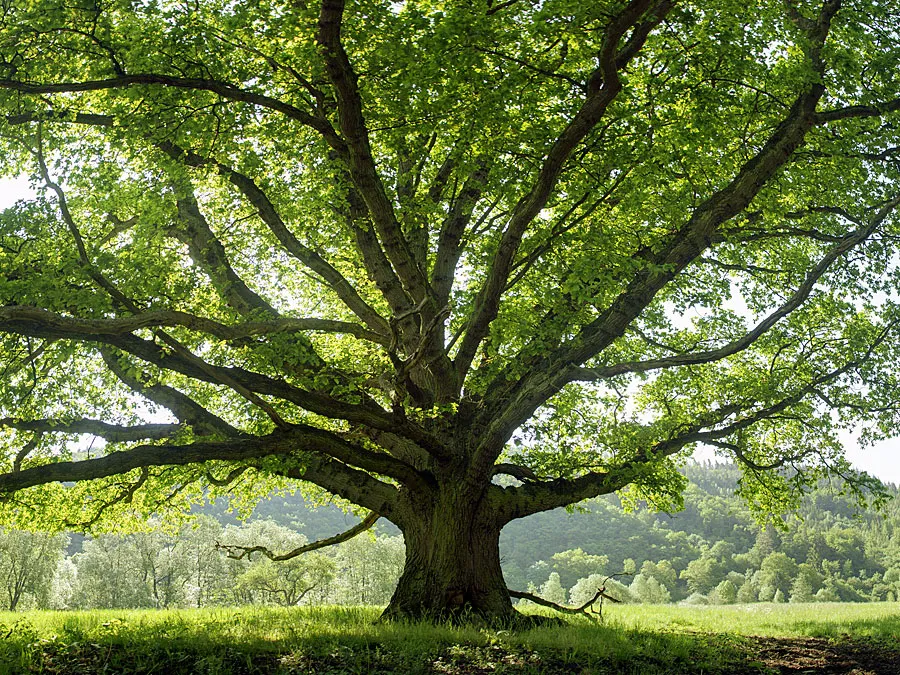

As a person who has loved music their entire life but only started learning how to play it and make songs at the age of eighteen, the usual rituals for entering the world of music were not very suited to me.

#### I have never wanted to perform

The tradition of making people audition to enrol on music courses or get a place in a choir is not suited to the kind of person I am. It demands that we possess things we might not have. If not prior education, then confidence and a desire to perform.

Personally, while I love music and love to sing, I have never wanted to perform.

Yet it seems there’s no – or very little – room in this world for a singer who doesn't want to sing publicly, or a musician who wants to play the piano and share that with others but isn’t comfortable playing in front of a large audience.

Being this way myself, I’ve found myself marginalised from the world of music and its communities again and again. Excluded from the conversations about music happening out there, just because I don’t wish to perform on a stage or post recordings on a YouTube channel or busk the streets.

I wonder if this has happened to others. I wonder if it’s happening to someone right now.

#### Everyone should get to contribute to the conversation about music

Everyone should be able to find a home in it if music is their home. This is kind of touching on the discussion about how introverts who have valuable ideas are too often not listened to. Perhaps this silencing of introverts is especially concentrated in music communities than it is in other communities. Because it seems incomprehensible to our society that music and the enjoyment of music could exist without performance.

The odd thing is that I've never even seen or heard anyone talk about this anywhere, online or in the non-virtual world. Perhaps that’s why I’ve taken so long to do this.

**Making a space, here with this blog, where people who love playing music – no matter what instrument or style – are free to engage in deep and thoughtful conversations about it, without ever having to worry that they’ll be asked to perform or ‘show’ others what they can do.**

I know I really could have done with a place like this. Even if I never got to speak to the person at least I could have felt connected to another human through music without having to lose or sacrifice something. Just reading their written thoughts about the learning or creative processes they are going through, the techniques they have discovered, or the emotional experiences they have had through music would have meant the world to me.

I could have returned again and again to a safe space of thought and reflection, learning and understanding of myself and others, and about music – the creation and experience of it – and I could have felt less alone in my journey in discovering music.

Thank you for letting in my thoughts. I hope you enjoy the rest of your visit.

_Gemma_
